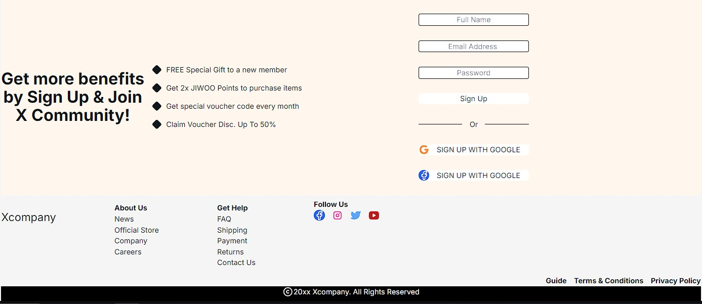

Hello Guy!
I 'm Tech Priest
and i 've started learning react(about 1 month) and i 've just finnished my first project and i used figma for designing and inspiring.

i made some components for simple shopping web site and i would 've liked to share it here (just components AND the app file which includ layout.tsx and page.tsx).
i used next js frame word and tailwind
sorry about nameing in project :)))
anyone can use my project and change one or two components if needed

but footer is not complete

Remember you must change properties such as image src and text ...

figma inspierd web likn:https://www.figma.com/design/oZfOspqIWAwQPVrImcfssG/MEJIWOO-Fashion---E-commerce-Website-Landing-Page-(Community)?node-id=0-1&node-type=canvas&t=Ofv9Tlv27pFSeOhG-0

sorry for my bad english by the way.
